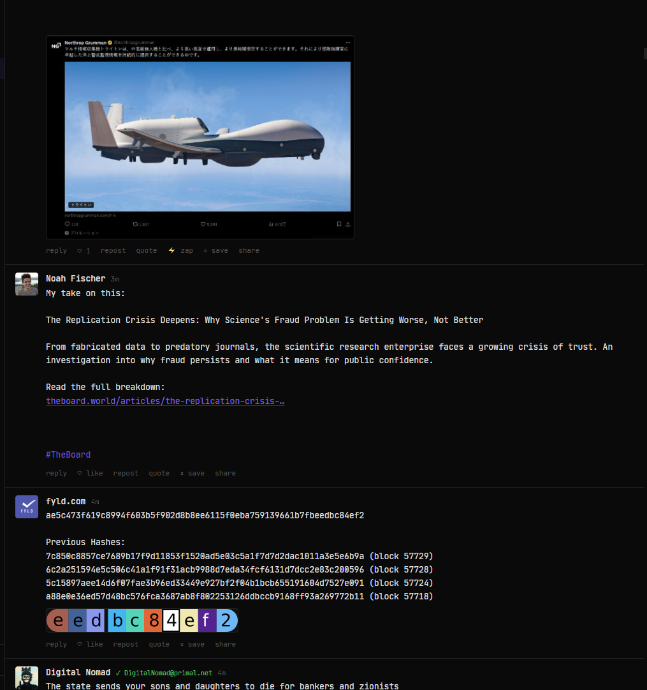
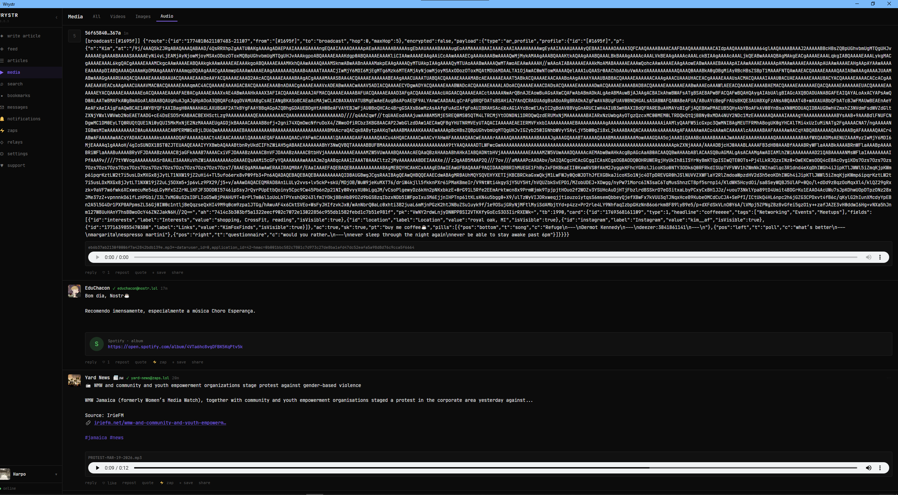
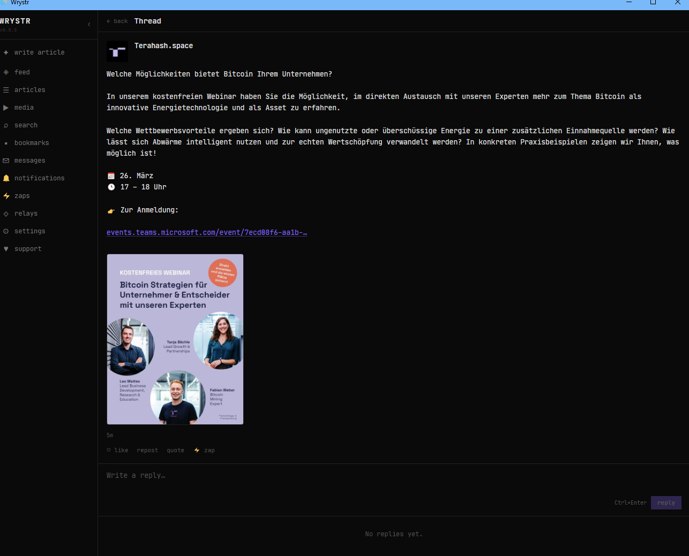
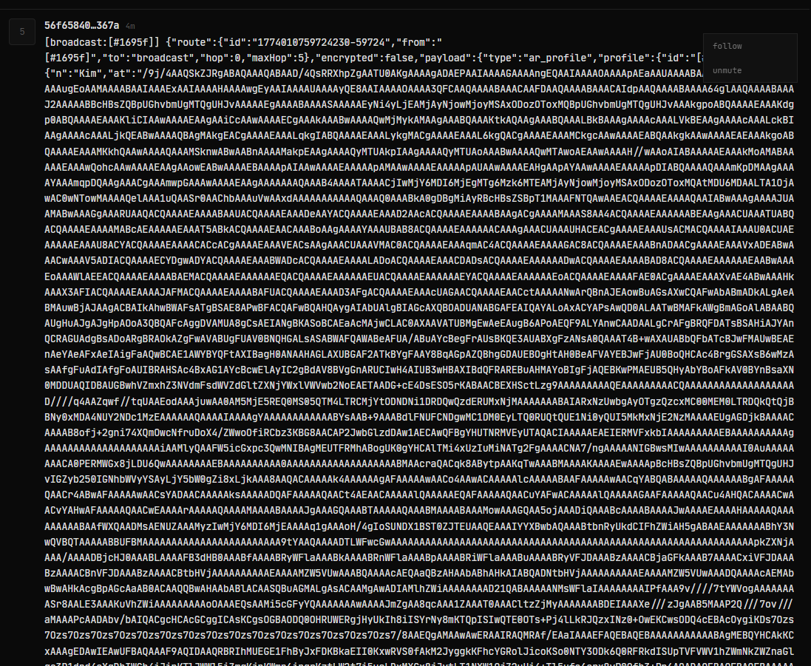
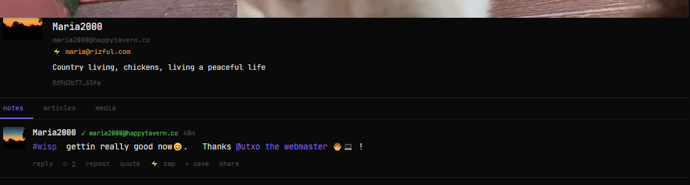
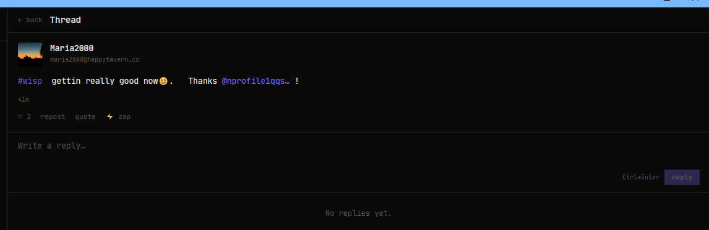
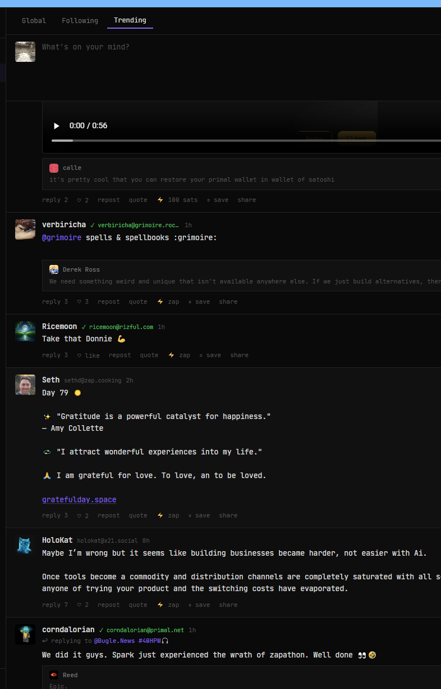
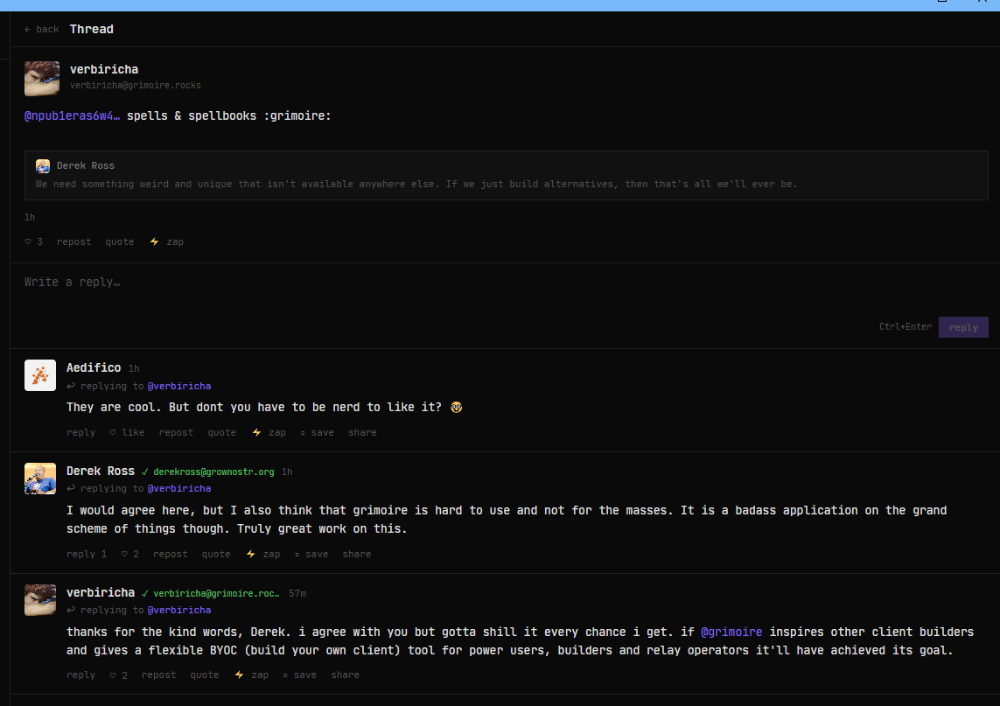
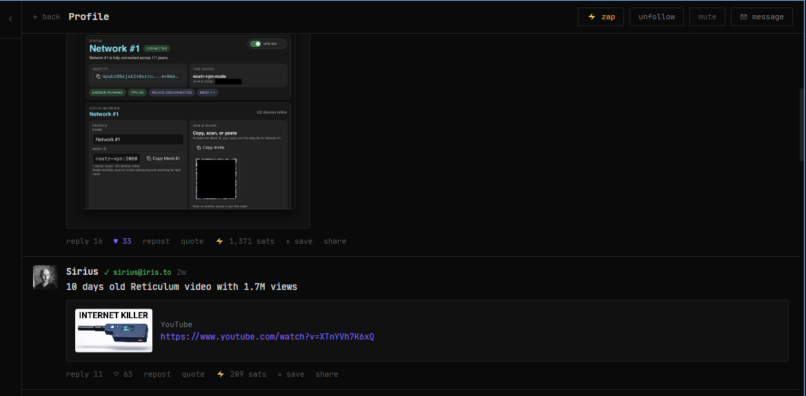
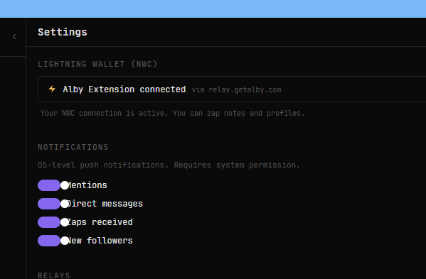

# Wrystr v0.8.3 Test Results

## Test Checklist

### Trending Feed (all platforms) ✅ TESTED

- Switch to "Trending" tab — should show notes from last ~24h, not ancient posts
- Articles (long-form) should appear mixed in with regular notes (rendered as article cards)
- Recently-posted popular notes should rank higher than older ones with same engagement (time decay)
- Empty state says "No trending notes right now" if nothing qualifies
- Refresh button works

### NIP-46 Remote Signer (all platforms)

- Onboarding: third "Remote signer" tab visible on login screen
- Pasting a bunker:// URI and clicking "Log in" shows "Connecting..." state
- Successfully connects if you have an nsecBunker/Amber instance (skip if no test signer available)
- Login Modal (add account): "Remote signer" tab present with bunker:// input
- Account Switcher: remote signer accounts show "NIP-46" label
- Timeout after 15s with clear error message if signer doesn't respond
- Session restores on app restart (if you can test with a real bunker)

### Media Feed (all platforms) ✅ TESTED

- "Media" item visible in sidebar (after "articles")
- Click opens media feed with header showing All / Videos / Images / Audio tabs
- "All" tab shows notes containing any media (images, videos, YouTube, audio)
- "Videos" tab filters to only video/YouTube/Vimeo content
- "Images" tab filters to only image content
- "Audio" tab filters to only audio/Spotify/Tidal content
- Empty state per tab if no matching content
- Clicking a note opens thread as expected

### Profile Media Gallery (all platforms) ✅ TESTED

- Open any profile — three tabs visible: Notes / Articles / Media
- "Media" tab shows a grid of images/videos/audio from that user's notes
- Images: click opens lightbox, arrow keys navigate, Escape closes
- Videos: show play button overlay, click opens the thread
- Audio: show music note icon, click opens the thread
- Grid layout: 2 columns default, 3 columns on wide screens
- Empty state "No media found." for profiles with no media

### Windows-Specific ✅ DONE. WORKING

- Installer runs (SmartScreen warning expected)
- App launches and connects to relays
- Auto-updater banner appears if upgrading from v0.8.2
- All four features above work

### General Regression

- Global/Following feed still works
- Compose + publish a note
- Articles tab in sidebar still works
- Search still works
- Sidebar collapsed/expanded state preserved
- Keyboard shortcuts (j/k/n//) still work

---

## Detailed Test Results

### Media Feed

**"Media" item visible in sidebar (after "articles")**
✅ YES!

**Click opens media feed with header showing All / Videos / Images / Audio tabs**
✅ YES

**"All" tab shows notes containing any media (images, videos, YouTube, audio)**
✅ YES

**"Videos" tab filters to only video/YouTube/Vimeo content**
✅ YES

**"Images" tab filters to only image content**
⚠️ Mostly true. Some posts appear that can't really be said to have an image:

**"Audio" tab filters to only audio/Spotify/Tidal content**
❌ Only gave 3 posts (all visible in screenshot) and only one of the three was actually clickable audio. This could maybe be corrected in the podcast sprint when the whole audio thing will be better organized and played?

**Empty state per tab if no matching content**
⚠️ Couldn't test

**Clicking a note opens thread as expected**
✅ This seems to be working too:

#### Additional Notes in Media Feed

Clicking on the `...` → "mute" doesn't result in an actual effect. Instead, if you click it again you just see "unmute" WHILE the post has not been muted.

---

### Trending Feed Test Results

**Switch to "Trending" tab — should show notes from last ~24h, not ancient posts**
✅ WORKS!

**Articles (long-form) should appear mixed in with regular notes (rendered as article cards)**
⚠️ Can't confirm yet

**Recently-posted popular notes should rank higher than older ones with same engagement (time decay)**
⚠️ Can't confirm yet

**Empty state says "No trending notes right now" if nothing qualifies**
⚠️ Can't confirm yet

**Refresh button works**
❌ Didn't see any changes in the trending feed after pressing it a few times. Can't say one way or the other

---

### Windows-Specific

**Installer runs (SmartScreen warning expected)**
✅ CHECK

**App launches and connects to relays**
✅ CHECK

**Auto-updater banner appears if upgrading from v0.8.2**
✅ CHECK

**All four features above work**
See results above

---

### NIP-46 Remote Signer (all platforms)

⚠️ CAN'T TEST most of it yet

**Onboarding: third "Remote signer" tab visible on login screen**
✅ CHECK

**Pasting a bunker:// URI and clicking "Log in" shows "Connecting..." state**
⚠️ Not tested

**Successfully connects if you have an nsecBunker/Amber instance**
⚠️ Skip if no test signer available

**Login Modal (add account): "Remote signer" tab present with bunker:// input**
⚠️ Not tested

**Account Switcher: remote signer accounts show "NIP-46" label**
⚠️ Not tested

**Timeout after 15s with clear error message if signer doesn't respond**
⚠️ Not tested

**Session restores on app restart**
⚠️ Can't test with a real bunker yet

---

### Profile Media Gallery (all platforms)

**Open any profile — three tabs visible: Notes / Articles / Media**
✅ CHECK

**"Media" tab shows a grid of images/videos/audio from that user's notes**
✅ CHECK

**Images: click opens lightbox, arrow keys navigate, Escape closes**
✅ CHECK

**Videos: show play button overlay, click opens the thread**
✅ CHECK

**Audio: show music note icon, click opens the thread**
⚠️ Not tested

**Grid layout: 2 columns default, 3 columns on wide screens**
✅ CHECK!

**Empty state "No media found." for profiles with no media**
⚠️ Can't confirm

---

## Additional Miscellaneous Issues

### 1. Names Sometimes Not Displayed

Names display inconsistently across different views. Examples:

**When viewing a post below a profile:**

**But clicking the same post in thread view shows full address:**

**Correct in Trending list:**

**But clicking same post shows different name resolution:**

### 2. Links Sometimes Don't Work

Some links are not clickable. For example, this YouTube video can't be clicked:

### 3. Missing "Supported NIPs" on README

🔴 **MUST ADD:** "Supported NIPs" section on the README page.

### 4. Notification Switches in Settings Look Ugly

### 5. Missing Emojis

Where exactly are emojis? Didn't we implement them some time ago?

---

## Summary

**Overall Status:** v0.8.3 has solid progress on Media Feed and Trending features.

**Strong Points:**
- Media feed displays correctly with proper filtering
- Profile media gallery works well (except Audio edge cases)
- Windows installer and auto-updater working
- NIP-46 Remote Signer UI present

**Issues to Address:**
- Audio tab filtering needs work (maybe defer to podcast sprint)
- Mute functionality broken
- Name resolution inconsistent across views
- Some links not clickable
- Notification UI needs refresh
- README missing "Supported NIPs" section
- Trending refresh button ineffective
